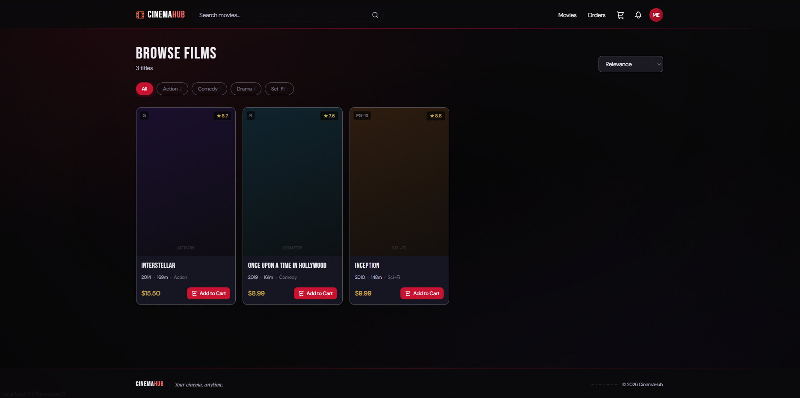
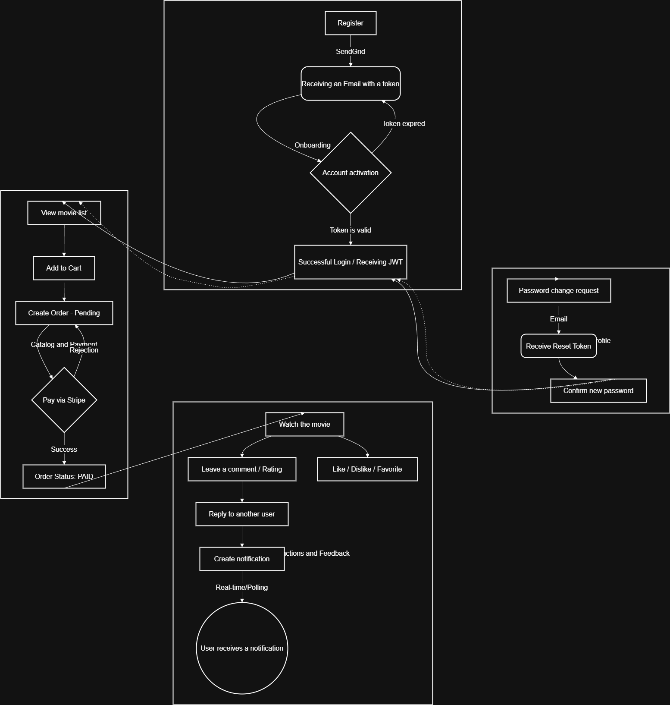
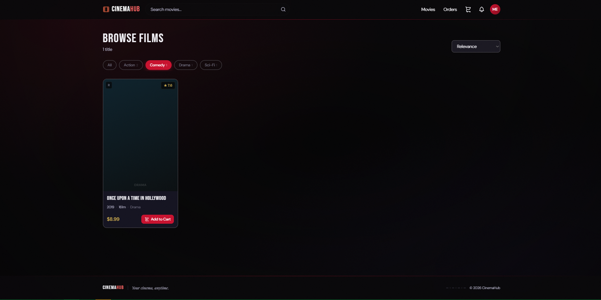
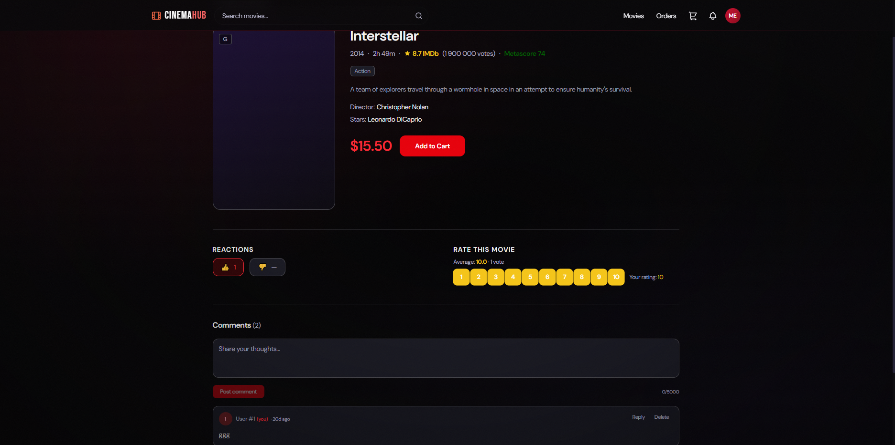
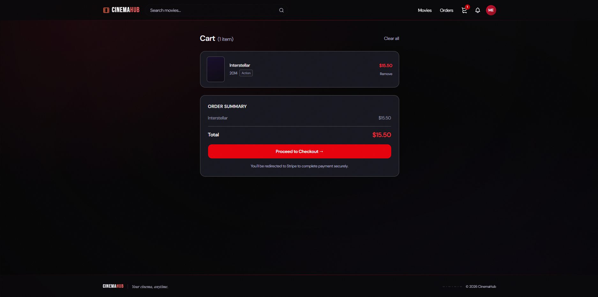
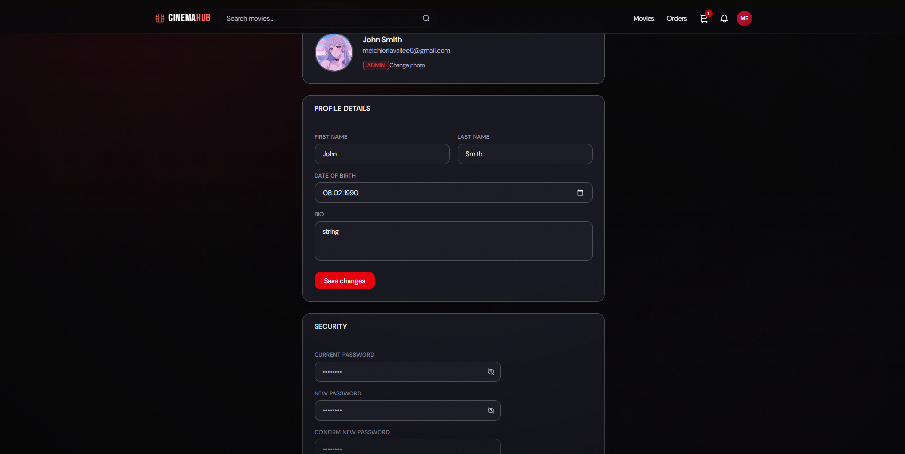
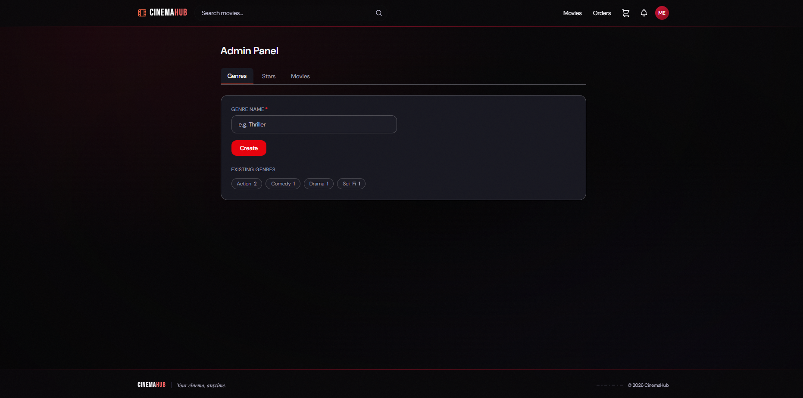

# CinemaHub

A full-stack online cinema platform where users browse, purchase, and interact with films. Built with a production-grade async FastAPI backend and a React 19 frontend with a custom cinematic design system.



---

## Contents

- [Features](#features)
- [Tech Stack](#tech-stack)
- [Architecture](#architecture)
- [Quick Start](#quick-start)
- [Environment Variables](#environment-variables)
- [Project Structure](#project-structure)
- [API Reference](#api-reference)
- [Frontend Pages](#frontend-pages)
- [Testing](#testing)
- [Database Migrations](#database-migrations)
- [CI / Linting](#ci--linting)
- [Git Workflow](#git-workflow)

---

## Features

**For users**
- Browse and search movies with genre filters and sort options
- Purchase films via Stripe Checkout — own them permanently
- React with likes/dislikes, rate films 1–10, and write nested comments
- Manage a cart, view order history, and track payment status
- Email activation, password reset, and avatar upload

**For moderators / admins**
- Create and manage genres, stars, directors, and movie entries
- Admin panel in the frontend with live entity management

**Platform**
- JWT authentication with silent token refresh
- Async background tasks via Celery + Redis (email dispatch, token cleanup)
- Real-time admin alerts via Telegram bot
- S3-compatible avatar storage (MinIO)
- Full test suite using SQLite in-memory — no Docker needed to run tests

---

## Tech Stack

### Backend

| Layer | Technology |
|---|---|
| Framework | FastAPI (async) |
| ORM | SQLAlchemy 2.0 (async) |
| Database | PostgreSQL 16 |
| Migrations | Alembic |
| Task queue | Celery + Redis |
| Payments | Stripe (Checkout Sessions + Webhooks) |
| Email | SendGrid (transactional templates) |
| Notifications | Telegram (aiogram) |
| Storage | MinIO / S3 (aioboto3) |
| Auth | JWT (access + refresh), bcrypt, role-based (USER / MODERATOR / ADMIN) |
| Validation | Pydantic v2 |
| Testing | pytest-asyncio + httpx AsyncClient + aiosqlite |
| Linting | Ruff |

### Frontend

| Layer | Technology |
|---|---|
| Framework | React 19 + Vite |
| Styling | Tailwind CSS v4 |
| Routing | React Router v7 |
| HTTP | Axios (with JWT refresh interceptor) |
| Payments | Stripe React |
| Fonts | Bebas Neue · Playfair Display · DM Sans |

---

## Architecture

The diagram below shows the four core user flows: onboarding, catalog & purchase, interactions, and password reset.



**Request flow (backend)**

```
Client → Nginx → Uvicorn (FastAPI)
                     │
                     ├── JWT validation (get_current_user)
                     ├── Role check (UserGroup: USER / MODERATOR / ADMIN)
                     ├── AsyncSession (PostgreSQL via asyncpg)
                     └── Background tasks → Celery → Redis → Worker
```

---

## Quick Start

### Requirements

- Python 3.12+
- Docker & Docker Compose
- Poetry 2+ — `pip install poetry`
- Node.js 18+

### 1. Clone the repository

```bash
git clone <repo-url>
cd online-cinema-fast-api
```

### 2. Configure environment

```bash
cp .env.example .env
# Edit .env with your credentials (see Environment Variables below)
```

### 3. Start backend services

```bash
# Build and start all services: app, db, redis, worker, beat
docker-compose up -d --build

# Apply migrations
docker exec -it cinema_app alembic upgrade head

# Seed the database with sample data
docker exec -it cinema_app python -m src.core.seed_db
```

| Service | URL |
|---|---|
| REST API | `http://localhost:8000` |
| Swagger UI | `http://localhost:8000/docs` |
| ReDoc | `http://localhost:8000/redoc` |

### 4. Start the frontend

```bash
cd frontend
npm install
npm run dev   # http://localhost:5173
```

> **Note:** The Vite dev server proxies all `/api` requests to `http://localhost:8000`, so no CORS configuration is needed during development.

---

## Environment Variables

Copy `.env.example` to `.env` and set the following:

| Variable | Description |
|---|---|
| `POSTGRES_HOST` | Database host (use `db` inside Docker) |
| `POSTGRES_USER` | PostgreSQL username |
| `POSTGRES_PASSWORD` | PostgreSQL password |
| `POSTGRES_DB` | Database name |
| `SECRET_KEY` | JWT signing secret (keep private) |
| `ACCESS_TOKEN_EXPIRE_MINUTES` | Access token lifetime |
| `REFRESH_TOKEN_EXPIRE_DAYS` | Refresh token lifetime |
| `STRIPE_SECRET_KEY` | Stripe secret key |
| `STRIPE_WEBHOOK_SECRET` | Stripe webhook signing secret |
| `SENDGRID_API_KEY` | SendGrid API key |
| `SENDGRID_FROM_EMAIL` | Verified sender email |
| `AWS_ACCESS_KEY_ID` | MinIO / S3 access key |
| `AWS_SECRET_ACCESS_KEY` | MinIO / S3 secret key |
| `S3_BUCKET_NAME` | Bucket name for avatars |
| `S3_ENDPOINT_URL` | MinIO endpoint URL |
| `TELEGRAM_BOT_TOKEN` | Telegram bot token for admin alerts |
| `TELEGRAM_CHAT_ID` | Chat ID to receive alerts |
| `REDIS_URL` | Redis broker URL |

---

## Project Structure

```
online-cinema-fast-api/
├── src/
│   ├── auth/           # Registration, login, JWT refresh/logout, activation,
│   │                   # password reset, user profiles, avatar upload
│   ├── movies/         # Movie catalog CRUD, genres, stars, directors, certifications,
│   │                   # advanced filtering, search, sorting
│   ├── interactions/   # Favorites, like/dislike reactions, 1–10 ratings,
│   │                   # nested comments, in-app notifications
│   ├── cart/           # Per-user cart with duplicate and already-owned guards
│   ├── orders/         # Cart → Order (PENDING) → Stripe Checkout → Order (PAID)
│   ├── payments/       # Payment records, Stripe webhook handler, refund tracking
│   ├── notifications/  # Email (SendGrid) and Telegram task dispatch
│   ├── tasks/          # Celery tasks: async email, periodic expired-token cleanup
│   └── core/           # Settings (.env), async DB session, S3Service,
│                       # Celery app, seed script, shared utilities
│
├── frontend/
│   └── src/
│       ├── api/        # Axios client with JWT interceptor + all API modules
│       ├── context/    # AuthContext (useAuth hook)
│       ├── components/ # Navbar, Footer, MovieCard, Pagination,
│       │               # ProtectedRoute, Spinner
│       └── pages/      # Home, MovieDetail, Login, Register, Activate,
│                       # Profile, Cart, Orders, Notifications,
│                       # Admin, PaymentSuccess, PaymentCancel
│
├── media/              # Screenshots and architecture diagrams
├── docker-compose.yml
├── Dockerfile
└── pyproject.toml
```

---

## API Reference

All routes are prefixed with `/api/v1`. Protected routes require `Authorization: Bearer <access_token>`.

### Authentication

| Method | Path | Auth | Description |
|---|---|---|---|
| `POST` | `/user/register/` | — | Register a new user |
| `POST` | `/user/login/` | — | Log in, receive access + refresh tokens |
| `POST` | `/user/logout/` | ✓ | Invalidate the current refresh token |
| `POST` | `/user/refresh/` | — | Exchange refresh token for new access token |
| `POST` | `/user/activate/` | — | Activate account via email token |
| `POST` | `/user/password-reset/` | — | Request password reset email |
| `POST` | `/user/password-reset/confirm/` | — | Set new password with reset token |
| `GET` | `/user/me/` | ✓ | Get current user profile |
| `PATCH` | `/user/me/` | ✓ | Update profile details |
| `POST` | `/user/me/avatar/` | ✓ | Upload avatar (S3) |

### Movies

| Method | Path | Auth | Description |
|---|---|---|---|
| `GET` | `/movies` | ✓ | List movies — supports `search`, `genre_id`, `sort_by`, `skip`, `limit` → `{total, items}` |
| `GET` | `/movies/{id}/` | ✓ | Movie detail |
| `POST` | `/movies` | Mod+ | Create movie |
| `PUT` | `/movies/{id}/` | Mod+ | Update movie |
| `DELETE` | `/movies/{id}/` | Mod+ | Delete movie |
| `GET` | `/genres` | ✓ | List genres with movie counts |
| `POST` | `/genres` | Mod+ | Create genre |
| `GET` | `/stars` | ✓ | List stars |
| `POST` | `/stars` | Mod+ | Create star |

### Cart & Orders

| Method | Path | Auth | Description |
|---|---|---|---|
| `POST` | `/cart/movies/` | ✓ | Add movie to cart |
| `DELETE` | `/cart/movies/{id}` | ✓ | Remove movie from cart |
| `DELETE` | `/cart/movies/` | ✓ | Clear entire cart |
| `POST` | `/order/` | ✓ | Create order from cart → returns `payment_url` |
| `GET` | `/order/my` | ✓ | List user's orders |
| `DELETE` | `/order/{id}/` | ✓ | Cancel a pending order |

### Interactions

| Method | Path | Auth | Description |
|---|---|---|---|
| `POST` | `/interactions/movies/reaction/` | ✓ | Like or dislike (`reaction: "LIKE"\|"DISLIKE"`) |
| `POST` | `/interactions/movies/rating/` | ✓ | Rate a movie (`score: 1–10`) |
| `POST` | `/interactions/movies/comments/` | ✓ | Post a comment (supports `parent_id` for replies) |
| `GET` | `/interactions/movies/{id}/comments/` | ✓ | Get comments for a movie |
| `GET` | `/interactions/notifications/` | ✓ | List in-app notifications |
| `PATCH` | `/interactions/notifications/{id}/` | ✓ | Mark notification as read |

---

## Frontend Pages

| Route | Access | Description |
|---|---|---|
| `/` | Public | Guest landing hero or authenticated movie grid |
| `/movies/:id` | Auth | Movie detail: info, reactions, rating, nested comments, add to cart |
| `/login` | Public | Sign in with JWT |
| `/register` | Public | Register with live password strength validation |
| `/activate` | Public | Email activation via URL token |
| `/profile` | Auth | Avatar upload, profile editing, change password |
| `/notifications` | Auth | In-app notifications with unread badge, mark as read |
| `/cart` | Auth | Cart items, order summary, Stripe Checkout |
| `/orders` | Auth | Order history with status (PENDING / PAID / CANCELLED), cancel option |
| `/payment/success` | Auth | Post-payment confirmation, cart cleared |
| `/payment/cancel` | Auth | Cancelled payment, cart preserved |
| `/admin` | Moderator+ | Create and manage genres, stars, movies |

### Screenshots

<table>
  <tr>
    <td><br/><sub>Browse Films — genre filters, sort, movie grid</sub></td>
    <td><br/><sub>Genre filtering — active chip with filtered results</sub></td>
  </tr>
  <tr>
    <td><br/><sub>Movie Detail — reactions, star rating, comments</sub></td>
    <td><br/><sub>Cart — order summary, Stripe Checkout</sub></td>
  </tr>
  <tr>
    <td><br/><sub>Profile — avatar, details, security settings</sub></td>
    <td><br/><sub>Admin Panel — genre/star/movie management</sub></td>
  </tr>
</table>

---

## Testing

Tests run against an isolated **SQLite in-memory** database. No Docker, no external services needed.

```bash
# Run all tests
poetry run pytest

# Run with verbose output
poetry run pytest -v

# Run a single test file
poetry run pytest src/tests/test_auth.py -v

# Run a single test by name
poetry run pytest src/tests/test_movies.py::test_create_movie_success -v
```

External services (Stripe, SendGrid, S3, Redis) are mocked automatically via the `mock_external_services` fixture. Use `moderator_client` for endpoints that require elevated permissions.

---

## Database Migrations

```bash
# Apply all pending migrations
docker exec -it cinema_app alembic upgrade head

# Create a new migration after model changes
docker exec -it cinema_app alembic revision --autogenerate -m "add column to movies"

# Check current migration state
docker exec -it cinema_app alembic current

# Roll back one migration
docker exec -it cinema_app alembic downgrade -1
```

---

## CI / Linting

CI runs on every push to `develop` and `main`, and on all PRs targeting `develop`.

**Pipeline steps:**
1. Ruff check — `poetry run ruff check .`
2. Ruff format — `poetry run ruff format . --check`
3. Full test suite — `poetry run pytest`

**Run locally before pushing:**

```bash
poetry run ruff check . --fix
poetry run ruff format .
poetry run pytest
```

---

## Git Workflow

```
feature/my-feature  →  develop  →  main
```

- All new work branches off `develop`
- PRs into `develop` require **2 approvals** and a green CI run
- `develop` merges into `main` for releases
- Commit messages follow conventional format: `feat:`, `fix:`, `chore:`, `docs:`, etc.

---

## Demo

[](https://www.youtube.com/watch?v=CLcsIiTjtX8&t=1s)
